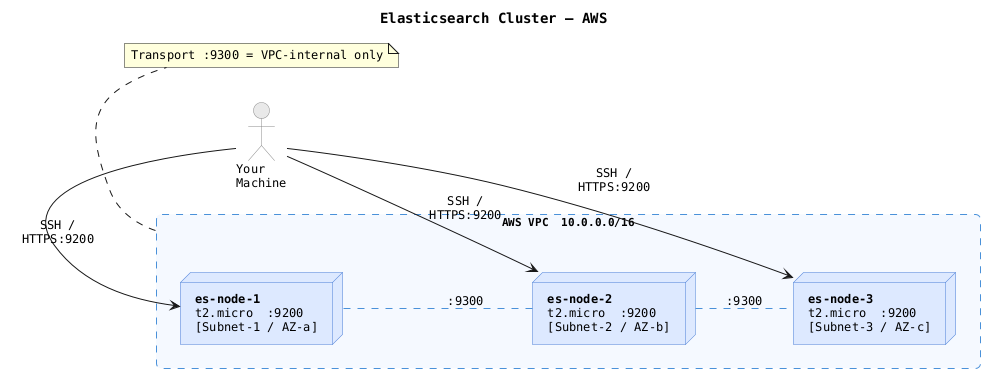

# Elasticsearch on AWS

Automated deployment of a 3-node Elasticsearch 8.x cluster on AWS Free Tier using Terraform for infrastructure provisioning and Ansible for configuration management. Supports both single-node and 3-node cluster modes.

## Table of Contents

- [Architecture Overview](#architecture-overview)
- [Prerequisites](#prerequisites)
- [Quick Start](#quick-start)
- [Security Design](#security-design)
- [Verification](#verification)
- [Answers to Exercise Questions](#answers-to-exercise-questions)
- [Resources Consulted](#resources-consulted)
- [Time Spent & Feedback](#time-spent--feedback)

## Architecture Overview



Design decisions:
- Each node is in a separate Availability Zone so the cluster survives a single AZ failure
- Port 9300 (transport) is VPC-internal only; nodes communicate internally but external access is blocked
- Port 9200 (HTTPS) and 22 (SSH) are restricted to your IP via Security Group
- EBS volumes are encrypted at rest
- TLS on both HTTP and transport layers
- xpack.security is enabled (Elasticsearch 8.x default)

## Prerequisites

| Tool | Version | Why |
|------|---------|-----|
| Terraform | >= 1.3 | Provision AWS infra |
| Ansible | >= 2.14 | Configure Elasticsearch |
| AWS CLI | >= 2.x | Authentication |
| curl | any | Smoke tests |

AWS Setup:
```bash
aws configure
# Enter: Access Key ID, Secret Access Key, Region (ap-southeast-1), output (json)
```

## Quick Start

### 1. Clone and configure

```bash
git clone <repo-url>
cd elasticsearch-aws/terraform-ansible
```

Set your IP (required — if omitted, `management_cidr` defaults to `0.0.0.0/0`, leaving ports 22 and 9200 open to the world):
```bash
MY_IP=$(curl -s ifconfig.me)
# pass as -var="management_cidr=${MY_IP}/32" in the apply command below
```

Change the passwords before deploying:

- **`elastic_password`** — pass via Terraform (this is what actually sets the password in play 03):
  ```bash
  -var="elastic_password=YourStrongPassword123!"
  ```
- **`kibana_password`** — edit `terraform-ansible/roles/elasticsearch/defaults/main.yml`:
  ```yaml
  kibana_password: "AnotherStrongOne456!"
  ```

### 2. Deploy (Terraform + Ansible, one command)

This project uses the Terraform Ansible provider, so a single `terraform apply` provisions the AWS infrastructure and runs all Ansible configuration automatically. No separate `ansible-playbook` step needed.

```bash
cd terraform-ansible

# Install Ansible collection dependency (only needed once)
ansible-galaxy collection install -r requirements.yml

# Initialize Terraform providers (only needed once)
terraform init

# Preview what will be created
terraform plan -var="management_cidr=YOUR_IP/32"

# Deploy everything
terraform apply -var="management_cidr=YOUR_IP/32"
```

Terraform will, in order:
1. Create a VPC, 3 subnets (one per AZ), Internet Gateway, Security Groups
2. Launch 3x `t2.micro` EC2 instances with encrypted EBS volumes
3. Generate an RSA-4096 SSH key pair and save it to `terraform-ansible/ssh_key.pem`
4. Run Ansible playbooks automatically via the Ansible provider:
   - `plays/01_bootstrap_primary.yml` - install ES + TLS on node-1
   - `plays/02_join_secondary.yml` - install ES + TLS on nodes 2 & 3, join cluster
   - `plays/03_configure_auth.yml` - set passwords for built-in users
   - `plays/04_validate_cluster.yml` - health checks and smoke tests

Expected output:
```
public_ips        = ["54.x.x.1", "54.x.x.2", "54.x.x.3"]
private_ips       = ["10.0.1.x", "10.0.2.x", "10.0.3.x"]
elasticsearch_url = "https://54.x.x.1:9200"
ssh_command       = "ssh -i ssh_key.pem ec2-user@54.x.x.1"
```

Total runtime is around 15-20 minutes (EC2 boot + ES install on 3 nodes + cluster formation).

### 3. Verify

```bash
# Replace NODE_IP and PASSWORD with values from Terraform output
curl -k -u elastic:YourStrongPassword123! \
  https://NODE_IP:9200/_cluster/health?pretty
```

Expected response:
```json
{
  "cluster_name" : "elasticsearch",
  "status" : "green",
  "number_of_nodes" : 3,
  "number_of_data_nodes" : 3,
  "unassigned_shards" : 0,
  ...
}
```

### Single-node mode (optional)

To deploy just 1 node instead of 3:
```bash
terraform apply \
  -var="management_cidr=YOUR_IP/32" \
  -var="cluster_size=1"
```

### Teardown

```bash
cd terraform-ansible
terraform destroy -var="management_cidr=YOUR_IP/32"
```

## Security Design

### 1. Authentication (xpack.security)
- Elasticsearch 8.x ships with `xpack.security.enabled: true` by default
- Built-in `elastic` superuser password set via `elasticsearch-reset-password`
- No anonymous access allowed

### 2. Encryption in Transit (TLS)
- HTTP layer: All client connections to `:9200` are HTTPS only. Plain HTTP is rejected.
- Transport layer: Inter-node communication on `:9300` uses mutual TLS.
- Certificates generated by `elasticsearch-certutil` using a self-signed CA.
- Per-node certs include both hostname and IP SANs.

### 3. Network Security (Security Groups)

| Port | Source | Purpose |
|------|--------|---------|
| 22 | Your IP only | SSH access |
| 9200 | Your IP only | REST API (HTTPS only) |
| 9300 | VPC (10.0.0.0/16) | Transport (internal only) |

### 4. Encryption at Rest
- All EBS volumes provisioned with `encrypted = true`

### 5. Key Management
- SSH key pair generated by Terraform (`tls_private_key`), saved locally with `chmod 600`
- Keystore passphrases are empty for simplicity; in production use AWS Secrets Manager or Vault

### 6. Production Best Practice: Secrets Manager

Passwords are currently passed via `-var` or hardcoded in `defaults/main.yml`. In production, pull them from AWS Secrets Manager instead so no secret ever lives in code or shell history.

**Step 1 — store the secret (one-time):**
```bash
aws secretsmanager create-secret \
  --name "elasticsearch/elastic_password" \
  --secret-string "YourStrongPassword123!" \
  --region ap-southeast-1
```

**Step 2 — pull it in Terraform (`data.tf`):**
```hcl
data "aws_secretsmanager_secret_version" "elastic_password" {
  secret_id = "elasticsearch/elastic_password"
}
```

**Step 3 — pass it to Ansible (`ansible.tf`):**
```hcl
extra_vars = {
  elastic_password = data.aws_secretsmanager_secret_version.elastic_password.secret_string
  ...
}
```

No `-var` flag needed. The secret is fetched at `terraform apply` time using the caller's IAM role — the password never touches the command line or a `.tfvars` file.

Extend the same pattern for `kibana_password` and any other credentials.

## Verification

Cluster health:
```bash
curl -k -u elastic:PASSWORD https://NODE_IP:9200/_cluster/health?pretty
```

List all nodes:
```bash
curl -k -u elastic:PASSWORD https://NODE_IP:9200/_cat/nodes?v
```

Confirm TLS is enforced (should fail, not return 200):
```bash
curl -v http://NODE_IP:9200/
```

Confirm auth is required (should return 401):
```bash
curl -k https://NODE_IP:9200/
```

Index and retrieve a document:
```bash
# Index
curl -k -u elastic:PASSWORD -X PUT https://NODE_IP:9200/test/_doc/1 \
  -H 'Content-Type: application/json' \
  -d '{"message": "hello world"}'

# Retrieve
curl -k -u elastic:PASSWORD https://NODE_IP:9200/test/_doc/1
```

## Answers to Exercise Questions

### 1. What did you choose to automate provisioning and bootstrapping? Why?

Terraform for infrastructure and Ansible for configuration management.

Terraform is declarative and idempotent, purpose-built for cloud resources. State tracking means re-running `apply` won't duplicate resources. The inventory template generates an Ansible-ready hosts file automatically, which removes manual wiring between the two tools.

Ansible is agentless (SSH-based), idempotent, and well-suited for application configuration. The role structure keeps concerns separated across install, TLS, configure, security, and verify stages. Compared to a plain shell script, Ansible gives better error handling and readable task intent.

Both tools are also explicitly mentioned in the exercise.

### 2. How did you choose to secure Elasticsearch? Why?

Three layers:

1. Perimeter: AWS Security Group restricts ports 22 and 9200 to your IP only. Port 9300 (transport) is VPC-internal only.

2. Encryption in Transit: xpack TLS on both HTTP (`:9200`) and transport (`:9300`) layers. Used `elasticsearch-certutil` instead of OpenSSL directly because it handles the PKCS#12 keystore format ES expects.

3. Authentication: `xpack.security.enabled: true` enforces credentials for all API calls. The built-in `elastic` superuser password is set during provisioning, making unauthenticated access return `401 Unauthorized`.

4. At rest: EBS volume encryption via AWS KMS (default key).

### 3. How would you monitor this instance? What metrics would you monitor?

CloudWatch Agent for infrastructure-level metrics, Elasticsearch's built-in `_cluster/health` and `_nodes/stats` APIs for application-level metrics, and CloudWatch Alarms for alerting.

Key metrics:

| Category | Metric | Alert Threshold |
|----------|--------|-----------------|
| Cluster | `cluster.status` | alert on red/yellow |
| JVM | `jvm.mem.heap_used_percent` | alert > 85% |
| Disk | `fs.total.available_in_bytes` | alert < 15% free |
| Indexing | `indices.indexing.index_time_in_millis` | alert on P99 spikes |
| Search | `indices.search.query_time_in_millis` | alert on P99 spikes |
| GC | `jvm.gc.collectors.young.collection_time_in_millis` | alert if GC pauses > 5s |
| OS | `cpu_utilization`, `memory_utilization` | alert > 90% |

For a production setup I'd use the Elasticsearch Exporter -> Prometheus -> Grafana stack, or ship to Elastic's own Observability solution.

### 4. Could you extend to a secure cluster of 3 nodes?

Yes, it's already implemented. Set `node_count = 3` in `variables.tf`.

What changes:
- Terraform spawns 3 EC2 instances across 3 AZs
- Elasticsearch `discovery.seed_hosts` is templated to include all private IPs
- `cluster.initial_master_nodes` lists all 3 nodes
- TLS certs are generated on node-1 then pushed to all other nodes
- All 3 nodes have `roles: [master, data]`, quorum is 2-of-3

For production I'd add dedicated master-eligible nodes (3) plus separate data nodes, but that exceeds free-tier constraints.

### 5. Could you replace a running instance with little/no downtime?

Yes. With a 3-node cluster:

1. Remove the node from the cluster (shard rebalancing happens automatically):
   ```bash
   PUT /_cluster/settings
   { "transient": { "cluster.routing.allocation.exclude._name": "es-node-2" } }
   ```
2. Wait for shards to relocate (`_cluster/health` returns green)
3. Terminate the old EC2 instance via Terraform: `terraform taint aws_instance.es_node[1]` + `terraform apply`
4. Terraform creates a fresh instance; Ansible rejoins it to the cluster
5. Re-enable routing once the new node is healthy

This achieves zero-downtime rolling replacement. With proper automation this could be a single command.

### 6. Was it a priority to make your code well structured, extensible, and reusable?

Yes. The codebase is organized with future maintainability in mind:

- Terraform variables for everything that changes per environment (region, node count, your IP)
- Ansible role structure (defaults -> tasks -> templates -> handlers) follows Ansible Galaxy conventions
- Parameterized templates: `elasticsearch.yml.j2` derives all cluster settings from inventory variables, not hardcoded values
- Single-node/multi-node toggle via a single variable, not two separate codebases
- Tags on all Ansible tasks so you can run `--tags verify` or `--tags tls` independently

### 7. What sacrifices did you make due to time?

1. Secrets management: Passwords are in `defaults/main.yml`. In production they'd live in AWS Secrets Manager or HashiCorp Vault, injected at runtime.

2. Certificate rotation: No automated cert renewal. A production setup would use AWS Certificate Manager or automate re-issuing before expiry.

3. Monitoring: Described above but not implemented in code. A full solution would add CloudWatch Agent configuration and Elasticsearch Exporter.

4. Load Balancer: Clients connect directly to a node. A production setup would front the cluster with an AWS ALB or NLB with health checks.

5. Private Subnets + Bastion: For proper network isolation, nodes should be in private subnets reachable only through a bastion host. Omitted here to simplify the free-tier setup (no NAT Gateway cost).

6. CI/CD: No GitHub Actions pipeline to lint Terraform (`terraform validate`) and Ansible (`ansible-lint`).

## Resources Consulted

- [Elasticsearch 8.x Security Documentation](https://www.elastic.co/guide/en/elasticsearch/reference/current/security-minimal-setup.html)
- [elasticsearch-certutil reference](https://www.elastic.co/guide/en/elasticsearch/reference/current/certutil.html)
- [Terraform AWS Provider docs](https://registry.terraform.io/providers/hashicorp/aws/latest/docs)
- [Ansible `uri` module](https://docs.ansible.com/ansible/latest/collections/ansible/builtin/uri_module.html)
- [Elasticsearch cluster discovery settings](https://www.elastic.co/guide/en/elasticsearch/reference/current/discovery-settings.html)

## Time Spent & Feedback

Time spent: ~2.5 hours

- Terraform (VPC, EC2, SG, key pair, inventory template): ~45 min
- Ansible role (install, TLS, configure, security, verify): ~70 min
- README + answers: ~35 min

Feedback on the exercise: The scope is well-calibrated. It covers real-world skills (IaC, security thinking, cluster concepts) within a realistic time constraint. The bonus cluster task is a natural extension that doesn't require a full rewrite.

One suggestion: clarifying whether "free tier" means strictly staying within the 750 hours/month limit across all 3 nodes (which puts you over for a cluster) or just using `t2.micro` would help set expectations.

## Project Structure

Terraform and Ansible live together in one directory. The Terraform Ansible provider wires them, so `terraform apply` runs all playbooks automatically.

```
elasticsearch-aws/
└── terraform-ansible/
    ├── main.tf              # EC2, VPC, SG, key pair, Ansible provider resources
    ├── variables.tf         # All configurable values (region, cluster_size, passwords)
    ├── outputs.tf           # Public IPs, ES URL, SSH command
    ├── versions.tf          # Provider version constraints
    ├── ansible.cfg          # Ansible settings (inventory, roles path, SSH args)
    ├── inventory.yml        # Ansible inventory (populated by Terraform Ansible provider)
    ├── requirements.yml     # Ansible collection: cloud.terraform
    │
    ├── plays/
    │   ├── 01_bootstrap_primary.yml   # Install ES + TLS on node-1, start cluster
    │   ├── 02_join_secondary.yml      # Install ES + TLS on nodes 2 & 3, join cluster
    │   ├── 03_configure_auth.yml      # Set passwords for built-in users
    │   └── 04_validate_cluster.yml    # Health checks and smoke tests
    │
    └── roles/elasticsearch/
        ├── defaults/main.yml          # All tunable defaults (version, passwords, paths)
        ├── handlers/main.yml          # Restart handler
        ├── tasks/
        │   ├── main.yml               # Orchestrates sub-tasks
        │   ├── install.yml            # Install ES + Java, swap, yum repo
        │   ├── tls.yml                # Generate CA + per-node certs, distribute
        │   ├── configure.yml          # Render elasticsearch.yml from template
        │   ├── service.yml            # Start service + wait for port 9200
        │   ├── security.yml           # Set elastic + kibana_system passwords
        │   └── verify.yml             # Smoke tests (health, auth, indexing)
        └── templates/
            ├── elasticsearch.yml.j2   # Main ES config (cluster, security, TLS, discovery)
            └── jvm.options.j2         # JVM heap size config
```
